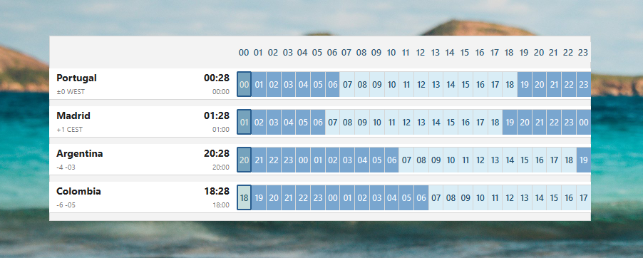
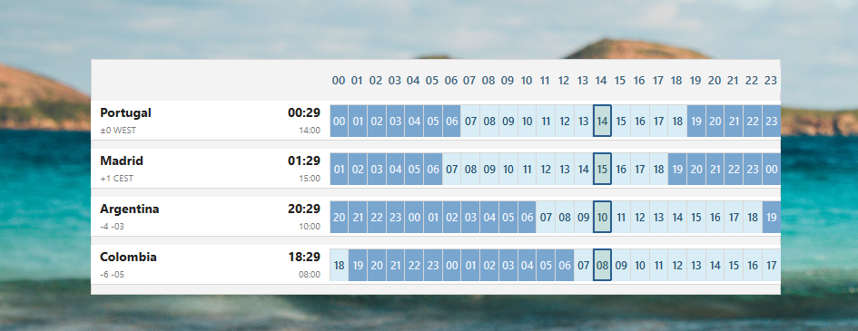

# WatchWidget

Desktop world clock widget for Windows 10/11.

The app is a small PySide6 widget that shows Portugal, Madrid, Argentina and Colombia in 24-hour format, with a synchronized day/night timeline.

## Preview

[](assets/watchwidget-preview.png)

[](assets/image.png)

## Requirements

- Windows 10 or Windows 11
- PowerShell
- Git
- Python 3.10 or newer
- `uv` from Astral

When installing Python, enable **Add Python to PATH**.

Check the basics:

```powershell
python --version
git --version
```

## Quick Install

Use this path on a normal Windows machine where PowerShell scripts are allowed.

```powershell
winget install --id Git.Git -e
winget install --id Python.Python.3.13 -e
irm https://astral.sh/uv/install.ps1 | iex
```

Close PowerShell, open a new one, then check:

```powershell
uv --version
```

Clone and run:

```powershell
cd C:\
mkdir Projetos
cd C:\Projetos
git clone https://github.com/Rmcd20/WidgetPRO.git
cd WidgetPRO
uv sync
uv run python -m watchwidget
```

Press `Esc` to close the widget.

## Restricted PowerShell Install

1. Open the official releases page:

   <https://github.com/astral-sh/uv/releases>

2. Download the Windows ZIP release.

3. Extract these files:

   - `uv.exe`
   - `uvx.exe`
   - `uvw.exe`

4. Create or reuse a local user `bin` folder:

```powershell for a new one
New-Item -ItemType Directory -Force "$env:USERPROFILE\bin"
```

5. Copy the extracted executables into that folder. Run this from the folder where the ZIP was extracted:

```powershell
Copy-Item .\uv.exe "$env:USERPROFILE\bin\"
Copy-Item .\uvx.exe "$env:USERPROFILE\bin\"
Copy-Item .\uvw.exe "$env:USERPROFILE\bin\"
```

6. Add the folder permanently to the user PATH:

```powershell
[Environment]::SetEnvironmentVariable(
    "Path",
    "$env:USERPROFILE\bin;" + [Environment]::GetEnvironmentVariable("Path", "User"),
    "User"
)
```

7. Close all PowerShell windows and open a new one.

8. Validate:

```powershell
uv --version
```

## Project Folder Setup

From the project folder:

```powershell
cd C:\Projetos\WidgetPRO
uv sync
```

`uv sync` creates/uses `.venv` and installs all dependencies from `pyproject.toml` and `uv.lock`.

If you cannot use `uv sync`, fallback:

```powershell
python -m venv .venv
.\.venv\Scripts\activate
uv pip install -e .
```

## Run The Widget

Recommended:

```powershell
uv run python -m watchwidget
```

## Start Automatically With Windows (Optional)

Use this only if you want the widget to open automatically every time you start the PC.

Do not use `uv run` inside a startup `.bat` if you want zero console windows.

Use `start-watchwidget.vbs`. It launches:

```text
.venv\Scripts\pythonw.exe -m watchwidget
```

Because it uses `pythonw.exe`, no empty Command Prompt window stays open.

Setup once:

```powershell
cd C:\Projetos\WidgetPRO
uv sync
```

Then add it to Windows startup:

1. Press `Win + R`
2. Type `shell:startup`
3. Create a shortcut to `C:\Projetos\WidgetPRO\start-watchwidget.vbs`

You can also double-click `start-watchwidget.vbs` to test it manually.

## Useful Commands

Update project from GitHub:

```powershell
cd C:\Projetos\WidgetPRO
git pull
uv sync
```

Run with console for debugging:

```powershell
uv run python -m watchwidget
```

Run without console:

```powershell
.\start-watchwidget.vbs
```

## Troubleshooting

### `uv` is not recognized

Close PowerShell and open a new one. If it still fails, check that this folder exists and contains `uv.exe`:

```powershell
$env:USERPROFILE\bin
```

Then confirm the folder is in PATH:

```powershell
$env:Path
```

### PowerShell blocks the installer

Use the manual ZIP installation described in **Restricted PowerShell Install**.

### `.venv\Scripts\activate` is blocked

You do not need to activate the environment if you use `uv run`:

```powershell
uv run python -m watchwidget
```

### Empty CMD window stays open

Use `start-watchwidget.vbs`, not a startup `.bat` that calls `uv run`.

### Explorer restart hides or changes the widget

Close and open the widget again:

```powershell
uv run python -m watchwidget
```
